# SPARK

Pyspark dan Scala keduanya digunakan untuk mengembangkan aplikasi big data pada framework Apache Spark dengan menyediakan antarmuka untuk akses fitur-fitur Spark. Pyspark adalah Python API, sementara Scala adalah bahasa pemrograman fungsional yang mendukung paradigma pemrograman berorientasi objek dan fungsional.

### Memulai Spark

Digunakan untuk menjalankan Apache Spark pada cluster mode dengan menjalankan semua proses Apache Spark di seluruh node pada cluster menggunakan perintah sudo ./start-all.sh setelah masuk ke direktori sbin pada instalasi Apache Spark. Namun, langkah-langkah tersebut mungkin perlu disesuaikan dengan konfigurasi cluster yang digunakan.

<table border="0">
 <tr>
    <td><b style="font-size:30px">Code</b></td>
    <td><b style="font-size:30px">Output</b></td>
 </tr>
 <tr>
    <td>cd /home/cloudera/spark-2.0.0-bin-hadoop2.7/sbin  sudo ./start-all.sh</td>
    <td></td>
 </tr>
</table> 

### Memulai Spark Shell

spark-shell adalah salah satu komponen dari Apache Spark yang menyediakan lingkungan pengembangan berbasis baris perintah (CLI) untuk interaktif menjalankan perintah-perintah Spark.

<table border="0">
 <tr>
    <td><b style="font-size:30px">Code</b></td>
    <td><b style="font-size:30px">Output</b></td>
 </tr>
 <tr>
    <td>spark-shell</td>
    <td>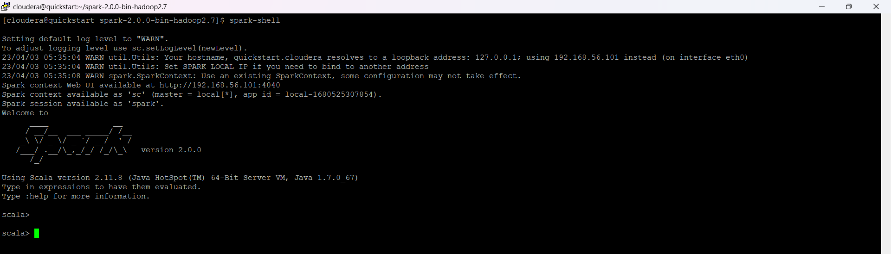</td>
 </tr>
  <tr>
    <td>import sys.process._ val res = "ls /tmp" ! println(res)</td>
    <td>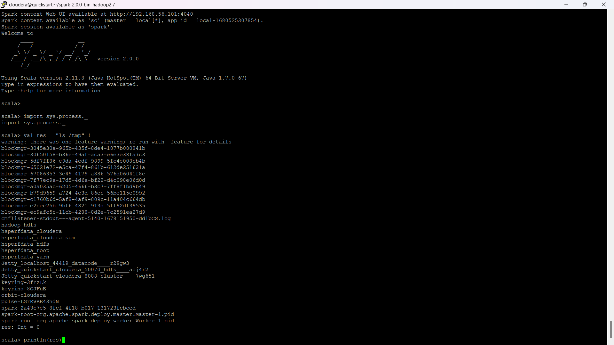</td>
 </tr>
 <tr>
    <td>:paste</td>
    <td>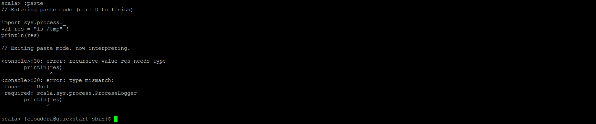</td>
 </tr>
</table> 
<h2>Alasan</h2>

Karena variabel "res" tidak memiliki tipe data yang didefinisikan sebelumnya sebelum digunakan dalam fungsi println() dan terjadi karena metode yang digunakan dalam perintah "ProcessLogger" harus mengembalikan nilai dari tipe "scala.sys.process.ProcessLogger", sedangkan fungsi println() mengembalikan nilai Unit.

### Memulai PySpark

PySpark adalah API Python untuk kerangka kerja pemrosesan data Apache Spark. Apache Spark sendiri adalah kerangka kerja open-source yang dirancang untuk memproses dan menganalisis data secara terdistribusi dan paralel pada cluster besar.

<table border="0">
 <tr>
    <td><b style="font-size:30px">Code</b></td>
    <td><b style="font-size:30px">Output</b></td>
 </tr>
 <tr>
    <td>pyspark</td>
    <td>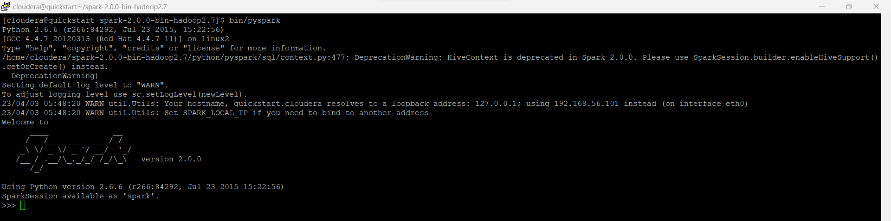</td>
 </tr>
</table> 

  <h1> Broadcast.py</h1>
  
menggunakan broadcast() pada SparkContext untuk mengirim list dari 1 hingga 99 ke setiap worker pada cluster. Nilai tersebut dapat diakses menggunakan .value.

  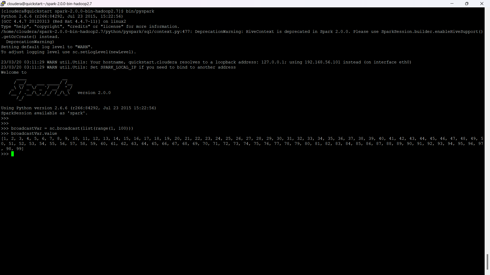
  
  <h1> UnderstandingRDDs.py</h1>
  
penggunaan PySpark pada mode standalone atau lokal, termasuk cara memulai command line dengan master tertentu dan memeriksa default parallelism. Selain itu, kode juga menunjukkan cara membuat RDD dengan jumlah partisi yang berbeda, mengakses isi setiap partisi, dan mengubah jumlah partisi dengan repartition() dan coalesce(). Terakhir, kode memeriksa grafik lineage RDD dengan toDebugString(). Kode ini dapat digunakan sebagai panduan dasar untuk penggunaan PySpark pada cluster atau mode lokal.

  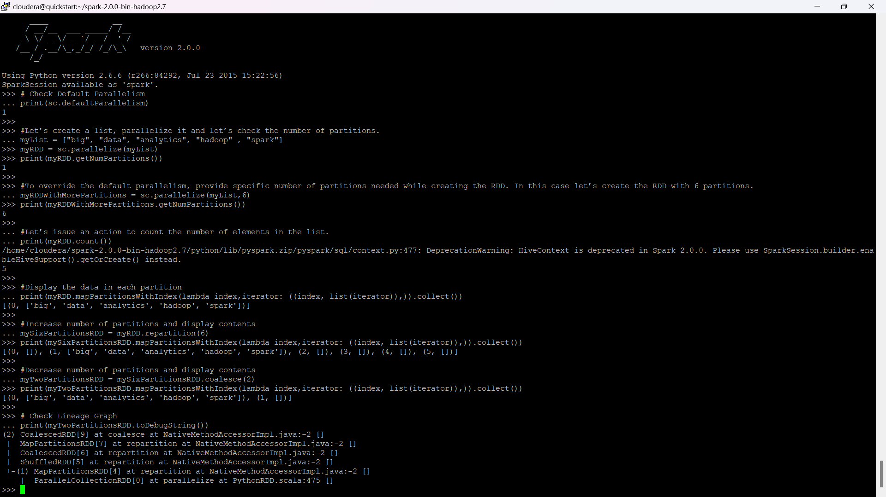

  <h1> WordCount.py</h1>
  
membaca file teks dari direktori tertentu menggunakan textFile() dari SparkContext dan melakukan penghitungan kata sederhana pada file tersebut. Kode menggunakan flatMap() untuk memisahkan setiap baris menjadi kata-kata, map() untuk menghitung jumlah kemunculan setiap kata, dan reduceByKey() untuk menggabungkan nilai-nilai yang sama menjadi satu nilai akhir. Output akhir dicetak menggunakan loop for. 

  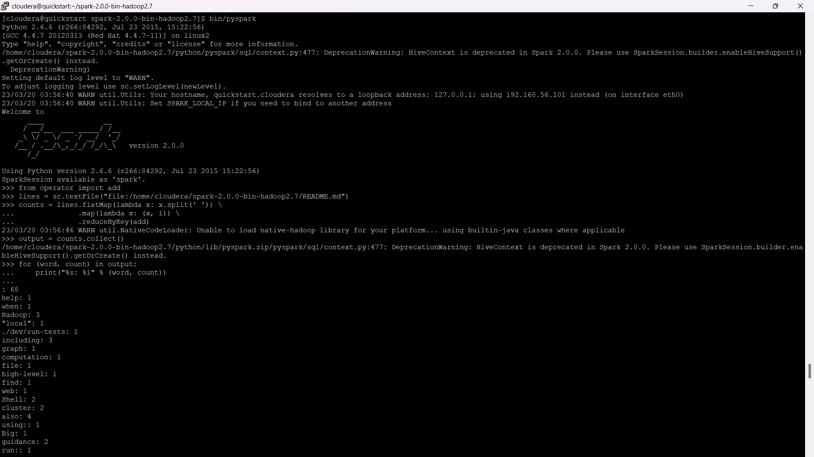
  
  <h1> SystemCommandsOutput.scala</h1>
  
mengeksekusi perintah shell hadoop fs -ls menggunakan operator !! dan menampilkan outputnya menggunakan println().

  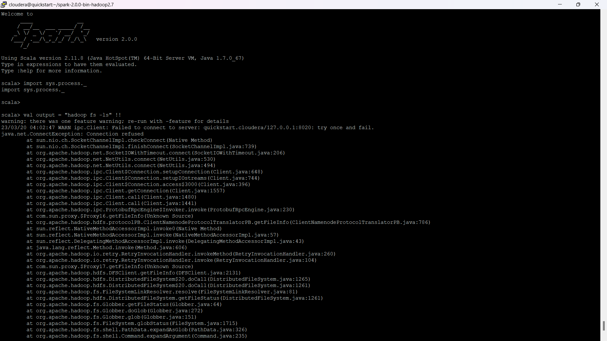

  <h1> SystemCommandsReturnCode.scala</h1>
  
import package sys.process untuk mengeksekusi perintah shell pada sistem operasi. Kode selanjutnya menjalankan perintah shell "ls /tmp" menggunakan operator ! dan menyimpan hasilnya dalam variabel res. Terakhir, kode mencetak hasil eksekusi perintah shell ke konsol dengan menggunakan println.

  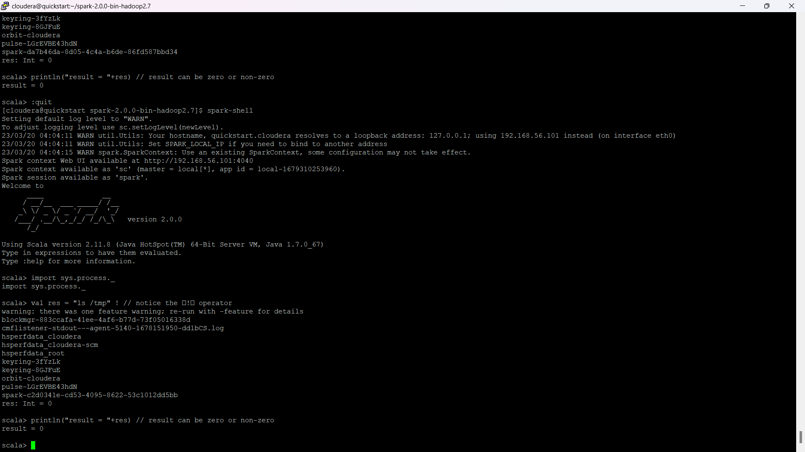
  
<h1> Accumulator.py</h1>
  
Program ini membuat objek accumulator dengan nilai awal 0 dan membuat RDD baru dengan elemen yang berasal dari rentang 1 hingga 99. Selanjutnya, program menggunakan foreach untuk menjalankan fungsi lambda pada setiap elemen dari RDD, yang menambahkan nilai elemen ke dalam accumulator. Terakhir, program mencetak nilai akhir dari accumulator ke konsol.

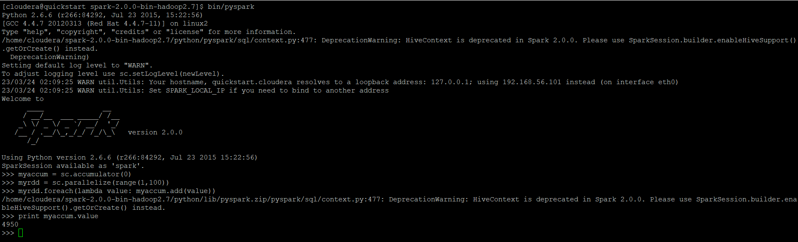

<h1> PairRDD.py</h1>
  
Program ini pertama-tama membuat sebuah list yang berisi tiga angka dan kemudian menjadikannya RDD dengan menggunakan sc.parallelize() dan menyimpannya ke dalam variabel myRDD. Selanjutnya, program memetakan setiap elemen RDD menjadi tuple dengan menggunakan fungsi map() dan menyimpan hasilnya dalam variabel myPairRDD. Kemudian, program menggunakan fungsi keys() untuk mengakses semua kunci dalam Pair RDD myPairRDD dan menyimpan hasilnya dalam variabel keys. Program juga menggunakan fungsi values() untuk mengakses semua nilai dalam Pair RDD myPairRDD dan menyimpan hasilnya dalam variabel values. Terakhir, program mencetak hasil kunci dan nilai ke konsol.

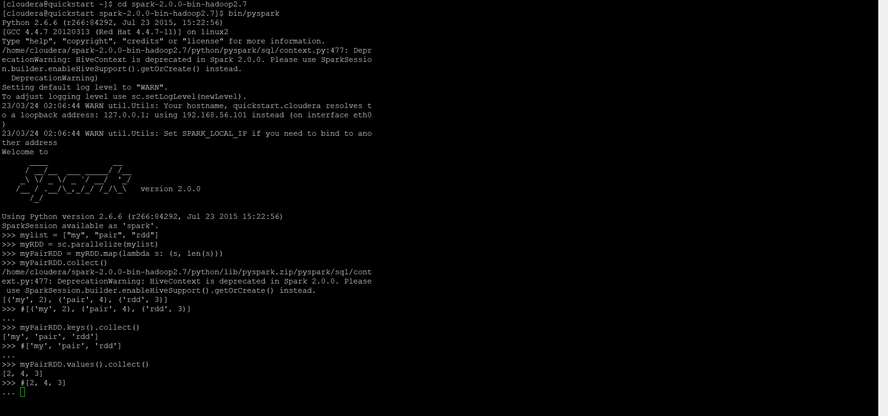

## Tugas Praktikum 2
### Kode 1
<table border="0">
 <tr>
    <td><b style="font-size:30px">Code</b></td>
    <td><b style="font-size:30px">Penjelasan</b></td>
 </tr>
 <tr>
    <td>sc</td>
    <td>

SparkContext (sc) digunakan untuk mengatur koneksi dengan cluster Spark dan membuat RDD</td>
 </tr>
 <tr>
    <td>accumulator</td>
    <td>

accumulator digunakan untuk menjumlahkan atau menghitung variabel di seluruh node pada cluster.</td>
 </tr>
 <tr>
    <td>parallelize</td>
    <td>

Parallelize adalah metode untuk membuat RDD dari kumpulan data pada driver program dan didistribusikan ke semua node dalam cluster Spark.</td>
 </tr>
  <tr>
    <td>lambda</td>
    <td>

Lambda adalah fungsi anonim pada Python untuk mengeksekusi fungsi sederhana, dan sering digunakan untuk membuat fungsi pada operasi RDD seperti map() dan filter().</td>
 </tr>
   <tr>
    <td>value</td>
    <td>

Value adalah tipe data pada PySpark untuk menyimpan data tunggal dalam sebuah RDD, dan tidak dapat diubah setelah dibuat.</td>
 </tr>
</table> 

### Kode 2
<table border="0">
 <tr>
    <td><b style="font-size:30px">Code</b></td>
    <td><b style="font-size:30px">Penjelasan</b></td>
 </tr>
 <tr>
    <td>broadcast</td>
    <td>

Broadcast digunakan untuk menyebarluaskan variabel atau nilai ke semua node di cluster Spark tanpa harus menyalin data pada setiap node.</td>
 </tr>
  <tr>
    <td>list</td>
    <td>

List adalah tipe data pada Python untuk menyimpan kumpulan nilai atau objek, yang digunakan pada PySpark untuk membuat RDD dari kumpulan data yang diinginkan.</td>
 </tr>
   <tr>
    <td>range</td>
    <td>

Range adalah fungsi bawaan pada Python untuk membuat urutan bilangan bulat, yang sering digunakan pada PySpark untuk membuat RDD dengan urutan bilangan bulat tertentu.</td>
 </tr>
</table> 

### Kode 3
<table border="0">
 <tr>
    <td><b style="font-size:30px">Code</b></td>
    <td><b style="font-size:30px">Penjelasan</b></td>
 </tr>
 <tr>
    <td>textFile</td>
    <td>

textFile adalah metode PySpark yang digunakan untuk membaca file teks dan membuat RDD dari setiap baris dalam file.</td>
 </tr>
  <tr>
    <td>filter</td>
    <td>

Operasi filter pada PySpark digunakan untuk memfilter elemen dalam RDD berdasarkan kondisi tertentu, dan menghasilkan RDD baru yang hanya berisi elemen yang memenuhi kondisi tersebut.</td>
 </tr>
   <tr>
    <td>cache</td>
    <td>

Cache pada PySpark digunakan untuk menyimpan RDD dalam memori pada node di cluster, sehingga mempercepat proses yang memerlukan akses ke RDD tersebut. </td>
 </tr>
    <tr>
    <td>count</td>
    <td>

Count adalah operasi pada PySpark yang digunakan untuk menghitung jumlah elemen dalam RDD.</td>
 </tr>
</table> 

### Kode 4
<table border="0">
 <tr>
    <td><b style="font-size:30px">Code</b></td>
    <td><b style="font-size:30px">Penjelasan</b></td>
 </tr>
 <tr>
    <td>map</td>
    <td>
operasi pada PySpark yang digunakan untuk melakukan transformasi pada setiap elemen dalam RDD dan menghasilkan RDD baru.
</td>
 </tr>
  <tr>
    <td>collect</td>
    <td>
operasi pada PySpark yang digunakan untuk mengumpulkan semua elemen dalam RDD dan mengembalikan hasilnya dalam bentuk list di driver program.

</td>
 </tr>
   <tr>
    <td>len</td>
    <td>
fungsi bawaan pada Python untuk menghitung panjang dari objek seperti list, tuple, atau string.
</td>
 </tr>
   <tr>
    <td>keys</td>
    <td>
metode pada PySpark yang digunakan untuk mengambil semua kunci dalam sebuah RDD yang berisi pasangan kunci-nilai (key-value pairs).

</td>
 </tr>
    <tr>
    <td>values</td>
    <td>
metode pada PySpark yang digunakan untuk mengambil semua nilai dalam sebuah RDD yang berisi pasangan kunci-nilai (key-value pairs).
</td>
 </tr>
</table> 

### Kode 5
<table border="0">
 <tr>
    <td><b style="font-size:30px">Code</b></td>
    <td><b style="font-size:30px">Penjelasan</b></td>
 </tr>
 <tr>
    <td>defaultParallelism</td>
    <td>
mengembalikan jumlah partisi yang akan dibuat secara default untuk RDD baru.
</td>
 </tr>
  <tr>
    <td>getNumPartitions</td>
    <td>
mengembalikan jumlah partisi dari RDD.
</td>
 </tr>
  <tr>
    <td>mapPartitionsWithIndex</td>
    <td>
operasi pada PySpark yang digunakan untuk memetakan setiap partisi RDD dengan indeks partisi-nya.
</td>
 </tr>
  <tr>
    <td>repartition</td>
    <td>
operasi pada PySpark yang digunakan untuk mengubah jumlah partisi RDD menjadi jumlah partisi yang baru.
</td>
 </tr>
   <tr>
    <td>coalesce</td>
    <td>
operasi pada PySpark yang digunakan untuk mengurangi jumlah partisi RDD menjadi jumlah partisi yang lebih sedikit.
</td>
 </tr>
  <tr>
    <td>toDebugString</td>
    <td>
metode pada RDD yang digunakan untuk mengembalikan string yang menjelaskan struktur RDD, termasuk informasi partisi dan lokasi node.
</td>
 </tr>
</table> 
